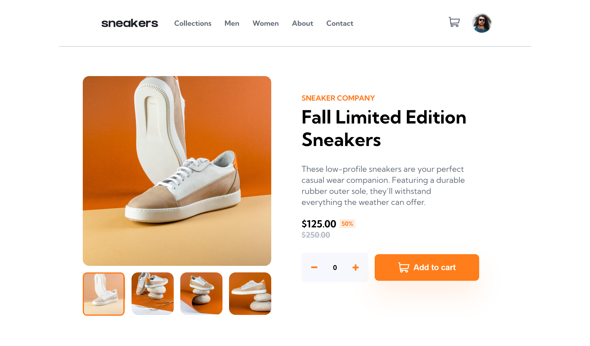

# Frontend Mentor - E-commerce product page solution

This is a solution to the [E-commerce product page challenge on Frontend Mentor](https://www.frontendmentor.io/challenges/ecommerce-product-page-UPsZ9MJp6). Frontend Mentor challenges help you improve your coding skills by building realistic projects.

## Table of contents

- [Overview](#overview)
  - [The challenge](#the-challenge)
  - [Screenshot](#screenshot)
  - [Links](#links)
- [My process](#my-process)
  - [Built with](#built-with)
  - [What I learned](#what-i-learned)
  - [Challenges](#challenges)
  - [Continued development](#continued-development)
  - [Useful resources](#useful-resources)
- [Author](#author)


## Overview

### The challenge

Users should be able to:

- View the optimal layout for the site depending on their device's screen size
- See hover states for all interactive elements on the page
- Open a lightbox gallery by clicking on the large product image
- Switch the large product image by clicking on the small thumbnail images
- Add items to the cart
- View the cart and remove items from it

### Screenshot




### Links

- Solution URL: [Github](https://github.com/dstrickl7/sneakers)
- Live Site URL: [Sneakers website](https://dstrickl7.github.io/sneakers/)

## My process

### Built with

- Semantic HTML5 markup
- SCSS
- Flexbox
- CSS Grid
- Mobile-first workflow

### What I learned

Aside from my calculator project, this is the first project where I really had to use Javascript. While my code isn't particularly clever or concise, I'm proud of the fact that I didn't struggle as much as I did when I first started learning.
To see how you can add code snippets, see below:

I'm  particularly proud of the displayLightbox function. At first, I was only sure about making the lightbox display when a product was clicked, but I wasn't quite sure how to display a specific picture when it was clicked. After playing around in the console to see what information I could get from a click, I finally came up with the solution below which uses the image array I created earlier and the products id.

```js
const displayLightbox = () => {
  productImgs.forEach((product) =>
    product.addEventListener("click", () => {
      lightbox.classList.toggle("active");
      overlay.classList.toggle("active");
      switch (product.id) {
        case "product1":
          lightboxImg.src = images[0].src;
          k = 0;
          break;
        case "product2":
          lightboxImg.src = images[1].src;
          k = 1;
          break;
        case "product3":
          lightboxImg.src = images[2].src;
          k = 2;
          break;
        case "product4":
          lightboxImg.src = images[3].src;
          k = 3;
          break;
        default:
          lightboxImg.src = images[0].src;
          k = 0;
      }
    })
  );
};
```

### Challenges

- Lightbox 
  - Responsiveness - my initial layout only looked good on 1440px screens.
    - My solution: I reworked it and used CSS Grid to make it responsive on all desktop sizes
- Overlay for active images 
  - I wanted to use a div overlay, but couldn't figure out how to only activate one when an image was clicked. Since I used the same class name for all the overlays, when I added the active class, all the overlay divs became active. 
    - My solution: I switched to using a class and psuedo element, but ran into the issue of the border radius for my images being different. In order to make the overlay look reasonable, I split the difference in radius percentages and shrank the height and width.
  - When a product image is clicked, the corresponding lightbox image overlay doesn't activate
    - My solution: I attached a function that simulated a click event on the corresponding image
  - When switching images in the lightbox, the overlay isn't activated
    - My solution: I simulated a click on the target element

### Continued development

- The method I used to add items to the cart wouldn't work well in an environment that had multiple products. I think I would need to make a function that takes a product id and adds it to the cart by a unique id.
- My JS isn't very efficient and I would like to make it more succinct. 
- CSS calc function. I've noticed in the past, that while my layouts may be responsive, my text didn't grow with the page and I would have to manually resize text for larger screens. I'm interested to see if I can make use of the calc function to handle this more efficiently.

### Useful resources

- [MDN Web Docs](https://developer.mozilla.org/en-US/) - My go-to resource for syntax and use examples

## Author

- Website - [Curly Coder](https://www.curlycoder.com)
- Frontend Mentor - [@dstrickl7](https://www.frontendmentor.io/profile/dstrickl7)
- Github - [dstrickl7](https://github.com/dstrickl7)
